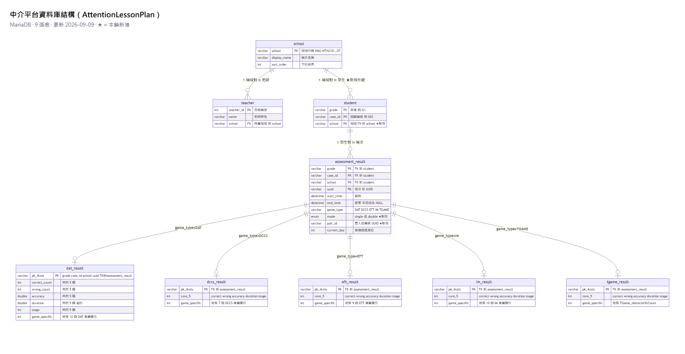
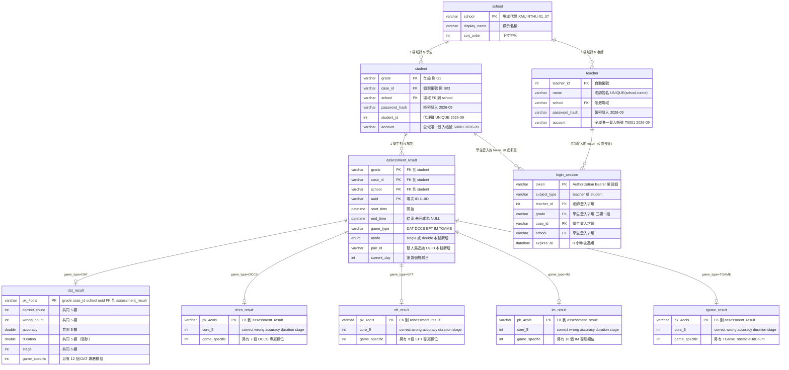

# 資料庫結構（中介平台 `AttentionLessonPlan`）

MariaDB。10 張表：3 張「參照 / 名冊」+ 1 張「登入憑證」+ 1 張「場次索引」+
5 張「各遊戲細部成績」。

- 精確 DDL：[`tests/schema.sql`](../tests/schema.sql)（正式庫與測試庫都照這份建）
- API 層的濃縮總覽（含端點）：[`backend-reference.md`](backend-reference.md)
- 2026-09-11：`teacher`/`student` 各加 `account`（全域唯一登入帳號）/
  `password_hash`；`student` 另加代理鍵 `student_id`；新增 `login_session`
  （登入 token）。決策脈絡見 [`adr/0004`](adr/0004-teacher-student-password-login.md)。
- 更早：`assessment_result` 加 `mode` / `pair_id`（單雙人版）；新增 `school` / `teacher`（選單登入）

---

## ER 圖



（下方是同一張圖的原始碼，在 GitHub 上會自動渲染；上方 PNG 供 GitHub 以外的地方看。）



> 每張 `*_result` 的主鍵都是 `(grade, case_id, school, uuid)` 四欄複合，同時是指向
> `assessment_result` 的外鍵。上圖為了好讀把這 4 欄縮成一列表示。

---

## 關係說明

| 關係 | 意義 |
|---|---|
| `school` → `teacher` | 一個場域有多位老師（目前每場域 2 位）。老師掛在不存在的場域 → 外鍵擋下 |
| `school` → `student` | 一個場域有多位學生。`student.school` 有外鍵 `fk_student_school` 指向 `school.school`（`ON UPDATE CASCADE`）—— 場域字串沒登記就插不進學生 |
| `student` → `assessment_result` | 一位學生有多場遊玩紀錄。學生唯一鍵是 `(grade, case_id, school)` 三欄複合 —— **不同場域的 `G1_S03` 是不同的學生** |
| `assessment_result` → 五張 `*_result` | 一場 = 一列 `assessment_result`（索引 + 共同欄位）+ 一列對應遊戲的細部表。`game_type` 決定掛哪張。刪 `assessment_result` 會連帶刪細部列（`ON DELETE CASCADE`） |
| `teacher`／`student` → `login_session` | 帳密登入後發的 token（2026-09）。一筆 `login_session` 只填其中一組外鍵（`teacher_id` 或 `grade`+`case_id`+`school`），另一組全 NULL——MySQL/MariaDB 的複合外鍵只要有一欄 NULL 就不檢查該筆，所以兩種登入共用一張表不用拆開。登出或帳號被刪會連帶清掉 token（`ON DELETE CASCADE`） |

> `school → teacher → student` 是「大到小」的階層，三者靠 `school` 字串（`KMU`、`NTHU-01`…`07`）串起來。
> 「某老師的學生」= 該老師 `teacher.school` 所對應的全部 `student`（同場域兩位老師看同一批）。
> 老師與學生之間**不需要**中介表：這層關係完全由兩邊的 `school` 值決定，可推導、無額外資訊。
> 若日後要「每位老師各帶一部分學生」，才需要 `student.teacher_id` 或 `teacher_student` 表。

---

## 2026-09-11：帳密登入加的結構

廠商改口，老師/學生都要帳號+密碼登入（原本是選單式免密碼），且老師只能查自己
場域的學生。決策脈絡見 [`adr/0004`](adr/0004-teacher-student-password-login.md)。

### `teacher`／`student` 各加 `password_hash`、`account`

- `password_hash`：pbkdf2 雜湊過的密碼，`varchar(255) NOT NULL DEFAULT ''`。
- `account`：**全域唯一**的登入帳號（`varchar(20) DEFAULT NULL` + `UNIQUE`），跟
  `teacher.name`／`studentKey`（`grade_caseId`）是分開的兩回事——後兩者都只在
  單一 `school` 內唯一，撐不住登入表單「不選場域、單靠一個欄位查到唯一一人」的
  需求。`DEFAULT NULL` 而不是空字串：同時多筆還沒指派帳號時，`UNIQUE` 索引才不會
  因為「多個空字串重複」而炸掉。

### `student` 另加代理鍵 `student_id`

`(grade, case_id)` 每個場域都會重複（每場域都有 `G1_S01`），沒辦法單獨當全域唯一
的登入帳號來源，所以加一個 `student_id int AUTO_INCREMENT UNIQUE`，純粹拿來推導
`account`（格式 `S0001`）。**不動**原本 `(grade, case_id, school)` 複合主鍵，
`assessment_result` 等表的外鍵完全不受影響。

### 新增 `login_session`

帳密登入後發的不透明 token，8 小時過期。故意不叫 `session`——這系統的 `session`
已經是「遊戲場次」（`assessment_result`）的代稱，混在一起會搞混。詳細欄位見上面
ER 圖，關係見「關係說明」表。

---

## 較早的結構變更

### `assessment_result` 加兩欄

| 欄位 | 型別 | 說明 |
|---|---|---|
| `mode` | `enum('single','double')` NOT NULL DEFAULT `'single'` | 這場是單人版還是雙人版。既有資料自動變 `single`，不用回填 |
| `pair_id` | `varchar(36)` NULL | 雙人局的識別碼（Unity 產生）。同一局的兩位學生兩筆共用一個。`single` 時為 NULL。目前只存不查，日後做「搭檔對照」再加索引 |

五張遊戲結果表**完全不動**（廠商定調雙人版欄位與單人版一樣）。

### 新增 `school`、`teacher`

做「場域 → 老師 → 學生 → 進度」的選單式登入（無密碼，廠商定調下拉選人）。
兩張都是「人工維護、量少、變動極慢」的參照資料，由 `seed_directory.py` 冪等灌注。

- `school.school` = 與 `student.school` 完全相同的字串。目前定案為 `KMU`、`NTHU-01`…`NTHU-07`
- `teacher` 沒有密碼欄位（不驗證）；`UNIQUE(school, name)` 防同場域重名

### `student.school` 加外鍵 `fk_student_school`

原本 `student.school` 只是一段自由字串，跟 `school` 表沒有資料庫層級的關聯，
所以 ER 圖上 `school` 與 `student` 之間沒有連線、打錯場域字串也不會報錯（那位學生
會從所有老師的清單裡消失）。本輪補上：

```sql
ALTER TABLE student
  ADD CONSTRAINT fk_student_school FOREIGN KEY (school)
  REFERENCES school (school) ON UPDATE CASCADE;
```

影響：

- Unity POST `/api/sessions` 帶未登記的 `school` → 寫入被擋，回 **400「未知的場域（school 尚未登記）」**（原本會 500）。
- 灌學生資料前，場域必須先存在（`seed.py` 已改成先冪等補上它用到的場域；
  測試輔助 `DbHelper.insert_student` 會自動 `ensure_school`）。
- 順帶替 `student.school` 建了索引，`fetch_students(school)` 不再全表掃描。

---

## 給你（或廠商）在 DBeaver 自己產 ER 圖

DBeaver Community 內建：

1. 左邊樹展開到 `AttentionLessonPlan`
2. 右鍵點 **Tables**（或該 database）→ **View Diagram**（檢視圖表）
3. 它會自動畫出所有表和外鍵連線
4. 右鍵圖 → **Save Diagram as → PNG / SVG** 可匯出成圖片給廠商

（`AttentionLessonPlan` 目前 `student` / 5 張結果表是空的 —— 空表不影響 ER 圖，結構照樣畫得出來。）
