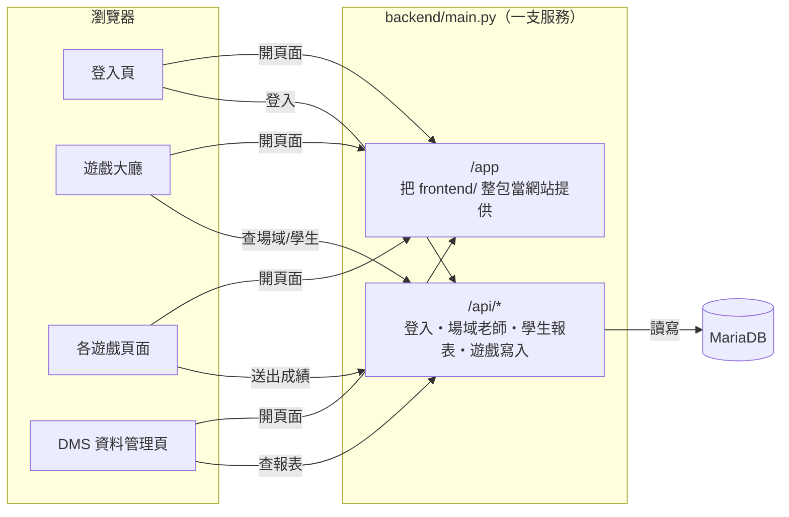
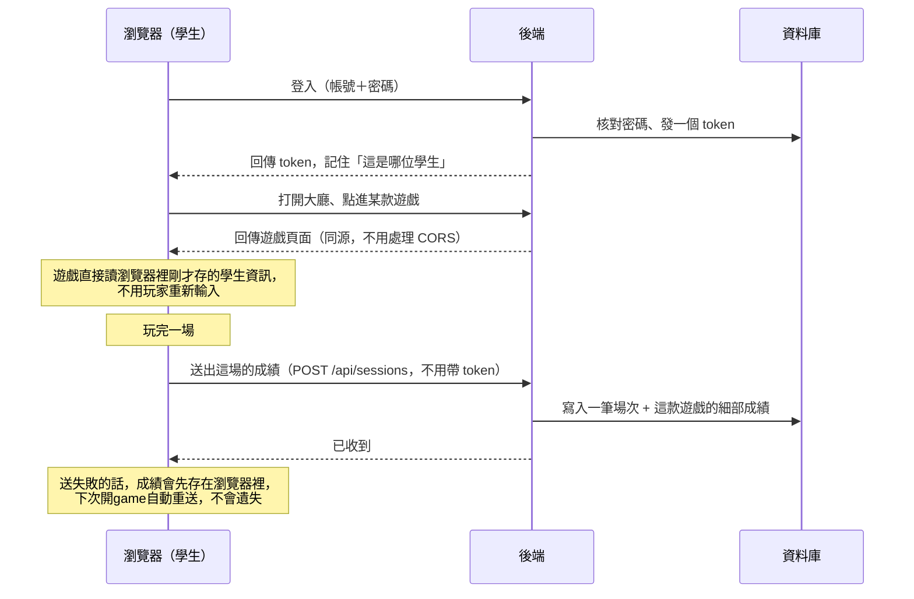
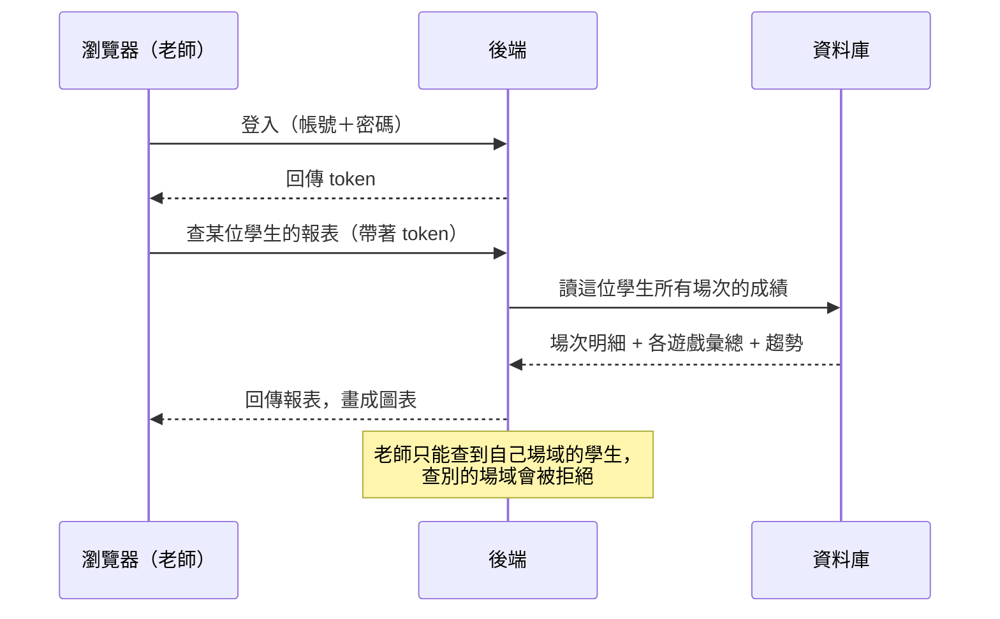
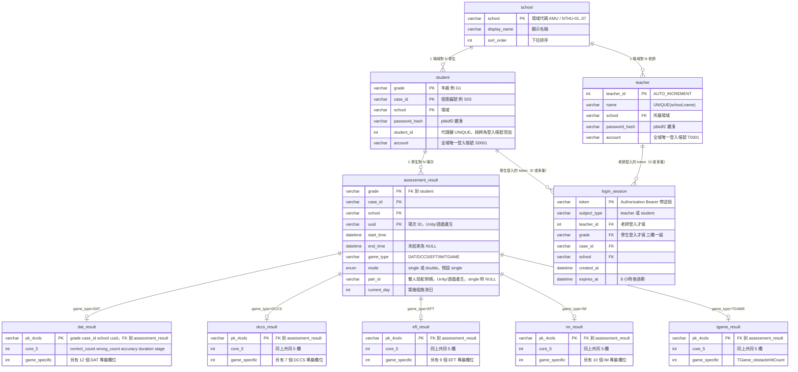

# 系統架構總覽

內容分四塊：系統流程架構、檔案架構、資料庫設計、測試帳密。

> **精確定義以程式碼為準**：API 是 `routers/*.py`，資料庫是
> [`tests/schema.sql`](../tests/schema.sql)。這份文件是濃縮整理，程式改了這份
> 可能會晚一步更新——衝突時以程式碼為準。
>
> 最後更新：2026-09-22（`main.py` 補靜態掛載、DCCS 併入 main、正式庫 schema 補齊
> 之後）。

---

## 目錄

0. [一分鐘總覽](#0-一分鐘總覽)
1. [系統流程架構](#1-系統流程架構)
2. [檔案架構](#2-檔案架構)
3. [資料庫設計](#3-資料庫設計)
4. [測試帳密](#4-測試帳密)
5. [相關文件索引](#5-相關文件索引)

---

## 0. 一分鐘總覽

只有三層：**瀏覽器（含遊戲）→ 一支 FastAPI 後端 → 一顆 MariaDB**。後端身兼兩個
角色：

- `/app/*`：把整個 `frontend/` 資料夾當靜態網站吐出去（登入頁、大廳、DMS、
  每一款網頁遊戲）。
- `/api/*`：真正的資料 API（登入、學生資料、報表、Unity/遊戲寫入成績）。

因為遊戲頁面跟 `/api/*` 同源，瀏覽器端**完全不需要處理 CORS**，遊戲程式碼裡
**也不會出現任何資料庫帳密**——寫資料庫的權限只活在後端伺服器裡。

```mermaid
flowchart LR
  B["瀏覽器<br/>登入頁／大廳／遊戲／DMS"] -- "同源 fetch" --> API["/api/*"]
  B -- "同源靜態檔" -.-> STATIC["/app 掛載<br/>= frontend/"]
  API --> DB[("MariaDB<br/>AttentionLessonPlan")]
```

---

## 1. 系統流程架構

拆成三張圖，每張只回答一個問題：頁面跟後端怎麼接起來？學生玩一場遊戲時資料
怎麼流動？老師怎麼看到成績？「哪個帳號能碰哪張表」不畫在這裡，見 §3.3 的表格。

### 1.1 瀏覽器怎麼跟後端接起來

一支後端、兩種用途：**開頁面走 `/app`，要資料走 `/api`**。因為兩者同一個
網域，瀏覽器完全不用處理 CORS。



### 1.2 學生玩一場遊戲



**中途離開也要送資料（2026-09-23 起）**：玩家切頁面、關分頁、還沒玩完就
離開，遊戲**一樣要送出**這場已經玩到的部分（見
[`unity-integration-guide.md` §9](unity-integration-guide.md#9-中途離開也要送資料2026-09-23-起)），
不能因為沒玩完就整筆略過不送。這是因為大廳的「訓練進度選擇」需要分辨
「玩過但沒玩完」跟「完全沒碰過」——如果中途離開完全不送資料，這兩種情況
在資料庫裡會長得一模一樣。判斷「玩滿了沒」的門檻是 `duration`
（見 §3.4）。DCCS 的參考實作在 `frontend/dccs/js/dccs.js` 的 `destroy()`。

### 1.3 老師查看學生報表



### 1.4 關鍵設計原則（決定「該怎麼串接」的規則）

- **遊戲永遠不需要知道資料庫在哪裡、帳密是什麼**。全程只認得自己所在的網域，
  只打一支端點：`POST /api/sessions`。
- **受試者資訊不經 URL 傳遞**。大廳與遊戲同源，遊戲自己讀 `sessionStorage`
  （`student1_key`／`student1_school`／`game_mode` 等，見 `frontend/js/app.js`
  怎麼寫入、`frontend/dccs/js/lobby.js` 怎麼讀）。
- **本機、正式站、之後換網域都不用改程式碼**。端點解析永遠是
  「同源 `${location.origin}/api/...`」，除非用 `window.API_BASE_URL` /
  `window.DCCS_SUBMIT_URL`（或各遊戲自己的等效變數）明確覆寫（Unity WebGL
  部署在別的網域才需要這樣做，見 `docs/unity-integration-guide.md`）。

---

## 2. 檔案架構

新 main 的資料夾規劃，每個遊戲各自一個子資料夾，彼此不會互相覆蓋到檔案。

```
backend/                              ← 只有後端負責人碰
├── main.py                           ← 建立 app、掛所有 router、CORS、/app 靜態掛載
├── db.py                             ← MariaDB 連線設定（read/write 兩組帳密）
├── auth.py                           ← 密碼雜湊、token 產生（純函式）
├── errors.py                         ← 共用 db_error()，DB 例外轉不洩漏細節的 500
├── converters.py                     ← 型別正規化、時間格式
├── models.py                         ← 所有 Pydantic 回應/請求模型
├── queries.py                        ← 讀取用 SQL（app_ro）
├── writes.py                         ← 寫入用 SQL（game_writer）：Unity 場次、登入 token
├── routers/
│   ├── auth.py                       ← 登入／登出端點
│   ├── identity.py                   ← 「每次呼叫都驗身份」的 dependency
│   ├── sessions.py                   ← POST /api/sessions（Unity/遊戲）、GET /api/games
│   ├── students.py                   ← /api/students、/sessions、/report
│   └── directory.py                  ← /api/schools、/api/me/students 等
├── seed.py                           ← 灌假成績到 _test（先清空再灌，帳密固定，見 §4）
├── seed_directory.py                 ← 冪等灌 school/teacher（測試庫密碼固定，正式庫隨機）
├── manage_passwords.py               ← CLI，手動重設單一老師/學生密碼
├── diff_schema.py                    ← CLI，比對兩個資料庫的表/欄位/索引/外鍵差異
├── db_accounts.sql                   ← 建 app_ro/game_writer/seeder 三組最小權限帳號
├── migrations/                       ← 正式庫的手動 DDL 變更紀錄（歷史留存）
├── tests/                            ← pytest，239+ 項，連真正的測試庫跑
│   └── schema.sql                    ← 資料庫結構的唯一真實來源（正式庫/測試庫都照這份建）
└── docs/                             ← 全部文件（含這份、給前端/Unity/DMS 的指南）

frontend/                             ← 大廳/登入頁由後端負責人維護；各遊戲資料夾各自的負責人維護
├── index.html                        ← 登入頁
├── games.html                        ← 遊戲大廳，GAME_PAGES 對照表決定點下去導去哪
├── dms.html                          ← 資料管理頁
├── js/
│   ├── app.js                        ← 登入邏輯，把 token/studentKey/school 寫進 sessionStorage
│   ├── api.js                        ← 共用的 API 呼叫封裝
│   └── dms.js
├── css/
└── dccs/                             ← 【範例】已完成串接的遊戲，其他遊戲照這個模式接
    ├── index.html                    ← 單人版殼
    ├── double.html                   ← 雙人版殼
    ├── SPEC.md / README.md           ← 完整規格與啟動說明
    ├── levels.json / manifest.json   ← 關卡設計表／建置產物
    ├── assets/                       ← 遊戲素材（唯讀，不得被其他程式碼修改）
    ├── css/
    └── js/
        ├── dccs.js                   ← 公開 API，main 專案唯一該碰的檔（mountDCCS）
        ├── main.js                   ← 獨立執行殼
        ├── lobby.js                  ← 與大廳的銜接（讀 sessionStorage、推導 currentDay）
        ├── net/apiBase.js            ← 端點解析（同源優先，可被明確覆寫）
        ├── net/client.js             ← buildPayload/submitResult，含送失敗暫存重送
        ├── core/ render/ game/ ui/   ← 遊戲迴圈、投影、規則、UI 疊層
    ├── <game-B>/                     ← 之後由 B 負責人加入
    └── <game-C>/                     ← 之後由 C 負責人加入
```

### 2.1 新遊戲要怎麼接進來

1. 整個遊戲放進自己的資料夾：`frontend/<game>/`，不動別人的資料夾。
2. 成績只送一支端點：`POST /api/sessions`，同源相對路徑（照 `dccs/js/net/apiBase.js`
   的優先序寫法：`window.DCCS_SUBMIT_URL` > `window.API_BASE_URL` > 同源 `/api/sessions`）。
3. 受試者資訊照 `dccs/js/lobby.js` 的模式，從 `sessionStorage` 讀，不要求玩家重新輸入。
4. 在 `frontend/games.html` 的 `GAME_PAGES` 對照表加一行：

   ```js
   const GAME_PAGES = {
     DCCS: { single: "dccs/index.html", double: "dccs/double.html" },
     // <GAME>: { single: "...", double: "..." },   ← 加這一行
   };
   ```

5. 開一個 PR，內容只有 `frontend/<game>/` ＋ `games.html` 那一行——不動
   `backend/` 任何檔案。真的需要動到後端（例如要多存一個遊戲專屬欄位），
   回報給後端負責人統一處理。

---

## 3. 資料庫設計

MariaDB，**10 張表**：3 張「參照/名冊」＋ 1 張「登入憑證」＋ 1 張「場次索引」＋
5 張「各遊戲細部成績」。完整 DDL 見 [`tests/schema.sql`](../tests/schema.sql)。

### 3.1 ER 圖



### 3.2 每張表的完整欄位

**`school`** — 場域清單（人工維護，量少）

| 欄位 | 型別 | 說明 |
|---|---|---|
| `school` PK | varchar(100) | 場域代碼，`KMU`、`NTHU-01`…`NTHU-07`（見 `docs/school-directory.md`，唯一真實來源） |
| `display_name` | varchar(100) | 顯示名稱 |
| `sort_order` | int | 下拉排序 |

**`teacher`** — 老師名錄

| 欄位 | 型別 | 說明 |
|---|---|---|
| `teacher_id` PK | int AUTO_INCREMENT | |
| `name` | varchar(50) | `UNIQUE(school, name)`，只在場域內唯一 |
| `school` FK→`school` | varchar(100) | |
| `password_hash` | varchar(255) | pbkdf2，預設空字串（未指派） |
| `account` | varchar(20) UNIQUE, NULL | 全域唯一登入帳號，`T0001` 格式 |

**`student`** — 學生名冊

| 欄位 | 型別 | 說明 |
|---|---|---|
| `grade`,`case_id`,`school` PK | varchar | 複合主鍵；`(grade, case_id)` 每場域都會重複，**不同場域的 `G1_S03` 是不同的學生** |
| `password_hash` | varchar(255) | 同上 |
| `student_id` | int AUTO_INCREMENT UNIQUE | 純粹為登入帳號加的代理鍵，不影響原本複合主鍵 |
| `account` | varchar(20) UNIQUE, NULL | 全域唯一登入帳號，`S0001` 格式 |

**`login_session`** — 帳密登入後發的 token

| 欄位 | 型別 | 說明 |
|---|---|---|
| `token` PK | varchar(64) | `Authorization: Bearer` 帶這個 |
| `subject_type` | enum('teacher','student') | |
| `teacher_id` FK→`teacher` | int NULL | 老師登入才填，`ON DELETE CASCADE` |
| `grade`,`case_id`,`school` FK→`student` | varchar NULL | 學生登入才填，`ON DELETE CASCADE` |
| `created_at`／`expires_at` | datetime | 8 小時後過期 |

**`assessment_result`** — 場次索引（一場遊戲 = 一列）

| 欄位 | 型別 | 說明 |
|---|---|---|
| `grade`,`case_id`,`school`,`uuid` PK | varchar | 前三欄 FK→`student` |
| `start_time`／`end_time` | datetime | 未結束時 `end_time` 為 NULL（API 回應轉成 `""`） |
| `game_type` | varchar(20) | `DAT`／`DCCS`／`EFT`／`IM`／`TGAME`（API 一律回 `TGame`） |
| `mode` | enum('single','double') | 預設 `single`。只有 DAT/DCCS/EFT 有雙人版 |
| `pair_id` | varchar(36) NULL | 雙人局的兩筆共用；後端只存不查 |
| `current_day` | int | 第幾個施測日，Unity/遊戲帶上來的，後端不推算 |

**`dat_result`／`dccs_result`／`eft_result`／`im_result`／`tgame_result`**

五張表結構相同的核心 5 欄，`ON DELETE CASCADE ON UPDATE CASCADE` 掛在
`assessment_result` 底下：

| 共同欄位 | 型別 | 說明 |
|---|---|---|
| `grade`,`case_id`,`school`,`uuid` PK | varchar | FK→`assessment_result` |
| `correct_count`／`wrong_count` | int | |
| `accuracy` | double | 0–1 |
| `duration` | double | 毫秒 |
| `stage` | int | 實際作答題數／關卡數 |

各遊戲另有專屬欄位（`dat_result` +12、`dccs_result` +7、`eft_result` +9、
`im_result` +10、`tgame_result` +1）。**目前 API 只回傳共同 5 欄**，專屬欄位
DB 裡有存，但沒有端點回傳。

### 3.3 資料庫帳號（最小權限）

| 帳號 | 權限 | 綁定庫 | 誰用 |
|---|---|---|---|
| `app_ro` | 只 `SELECT` | 正式庫 | 部署的後端，處理所有 GET |
| `game_writer` | 只對 7 張表 `INSERT`＋`login_session` 的 `INSERT/DELETE` | 正式庫 | 部署的後端，處理 `POST /api/sessions`、登入/登出 |
| `seeder` | 全權 | **只** `_test` | 本機開發、`seed.py`／`seed_directory.py`、pytest |
| `root` | 全權 | 全域 | 只人工維運，不進任何部署環境變數 |

建帳號的 GRANT 語法見 [`db_accounts.sql`](../db_accounts.sql)；決策脈絡見
[`adr/0001-least-privilege-db-accounts.md`](adr/0001-least-privilege-db-accounts.md)。

### 3.4 幾個容易搞混的設計規則

- **`school` 是整個系統的 join key**。前端／遊戲都不該寫死任何場域字串，一律
  `GET /api/schools` 拿清單、原樣存起來、原樣帶回。
- **老師與學生之間沒有中介表**。「某老師的學生」＝該老師 `school` 對應的
  全部學生，同場域的老師看到的是同一批人。
- **`game_type` 大小寫**：Unity/遊戲送 `TGame`，DB 存 `TGAME`，API 回應又轉回
  `TGame`；查詢參數大小寫不拘。
- **雙人版**：一台裝置兩個小孩，各記自己一筆，`pair_id` 由遊戲端在開局時
  產生（一個 GUID）、兩筆共用；後端只存不驗證配對正確性。
- **`current_day` 現在是玩家自選，不保證照時間順序累加**（2026-09-22 起）。
  大廳「訓練進度選擇」下拉選單（`frontend/games.html`）讓玩家自己選要玩第幾
  天，選了哪個數字就直接送進遊戲當 `currentDay`，不再強制用
  `frontend/dccs/js/lobby.js` 原本「依歷史場次自動推導、失敗就要求人工填寫」
  的邏輯（該邏輯還在，只是被玩家自選值蓋過去，見 `resolveCurrentDay()` 裡
  `KEY_SELECTED_DAY` 的判斷）。**這是已知、已確認接受的取捨**：同一位學生的
  `assessment_result.current_day` 可能出現同一天被重複選、或天數不連續跳著玩
  的情況。日後做 Round A／Round B 的趨勢分析、或任何假設「`current_day` 照
  時間順序累加、每個值只出現一次」的統計，都要先確認資料有沒有受這個影響，
  不能直接假設乾淨。
- **`stats` 不為 `None` 不代表「整場玩完」**（2026-09-23 起）。中途離開現在
  也會送出一筆場次（見上面 §1.2、`unity-integration-guide.md` §9），所以
  一筆 `*_result` 有資料，只代表玩家至少玩了一部分，不保證玩滿。真正的判斷
  依據是 `duration` 有沒有到達 `queries.FULL_SESSION_MS`（目前每款遊戲統一
  6 分鐘 / 360000ms，`frontend/games.html`、`backend/seed.py` 各自有一份同名
  常數，三處**必須手動保持一致**，改一處要記得檢查另外兩處）。後端的
  `routers/students.py`（`_is_completed()`）已經處理過：`GET /report` 的
  `summaryByGame`／`trends` 只採計玩滿的場次去算平均正確率、畫趨勢線，
  `sessionCount`／`totalDuration` 則兩種都算（回答「嘗試過幾次、花了多少
  時間」）。**日後若要直接查資料庫算統計、繞過這兩支組裝函式**，要記得自己
  重新套用同一條完成度判斷，不然中途離開的場次會拉低算出來的平均正確率。

---

## 4. 測試帳密

在**測試庫**（`AttentionLessonPlan_test`）裡，下面三組帳密是固定的——只要照
§4.1 的順序操作，永遠會拿到一樣的結果，不用另外去問人：

| 角色 | 帳號 | 密碼 | 對應 | 場域 |
|---|---|---|---|---|
| 老師 | `T0001` | `test1234` | 吳老師 | KMU |
| 學生 1 | `S0001` | `test1234` | G1_S01 | KMU |
| 學生 2 | `S0002` | `test1234` | G1_S02 | KMU |

三組同場域（KMU），老師登入看得到這兩位學生，兩位學生也可以直接拿來測雙人模式。

### 4.1 為什麼是固定的、什麼情況下會失效

`pytest` 的共用測試 fixture（`tests/conftest.py`）在每次用到資料庫的測試前後
都會把 `school`／`teacher`／`student`／`login_session`／`assessment_result`
等表**整個清空**，這是測試隔離機制，故意設計成這樣，不是 bug。

**規則只有一條：`pytest` 一定要排在灌資料之前跑，不能在之後。** 只要曾經在
灌完資料「之後」又跑過一次 `pytest`，上面三組帳密就會消失，需要照下面順序
重灌一次：

```bash
cd backend
uv run python seed_directory.py   # 先：場域／老師，測試庫密碼固定為 test1234
uv run python seed.py             # 後：學生／假成績，密碼固定為 test1234，帳號固定從 S0001 開始
```

重灌之後，上面表格的三組帳密會**原封不動地重新生成**——`seed.py` 清空
`student` 表時會把自動編號重置回 1，`seed_directory.py` 對測試庫也是固定密碼，
所以不會變成別的號碼。想自己確認目前有效帳號，可在 DBeaver 執行：

```sql
SELECT account, grade, case_id, school FROM student WHERE account IS NOT NULL ORDER BY student_id LIMIT 5;
SELECT account, name, school FROM teacher WHERE account IS NOT NULL ORDER BY teacher_id LIMIT 5;
```

### 4.2 怎麼登入測試

後端跑起來後（見 `backend/README.md`：`uv run uvicorn main:app --reload --port 5001`），
瀏覽器開 `http://127.0.0.1:5001/app/`——**不要**用檔案總管雙擊 `index.html`
（`file://` 開啟會讓 ES module 跟相對路徑 API 呼叫都失敗，這個前端本來就設計成
一定要由後端伺服器提供）。

- 老師登入：`T0001` / `test1234`
- 學生登入：`S0001` / `test1234`（或 `S0002`，同場域可測雙人）

**這組帳密只在測試庫有效，絕對不是正式庫的帳號。** 正式庫的老師帳密由
`uv run python seed_directory.py --prod` 個別產生、個別發放，密碼隨機、不會是
`test1234`。

---

## 5. 相關文件索引

這份文件是總覽，細節規格請看：

| 文件 | 給誰 | 內容 |
|---|---|---|
| [`unity-integration-guide.md`](unity-integration-guide.md) | 各遊戲負責人 | `POST /api/sessions` 完整規格、雙人版欄位、場域代碼表 |
| [`frontend-integration-guide.md`](frontend-integration-guide.md) | 前端／DMS | 所有 `/api/*` 端點完整 request/response 範例 |
| [`dms-integration-notes.md`](dms-integration-notes.md) | DMS／前端 | DB 關係、Session 表、進度怎麼算 |
| [`database-schema.md`](database-schema.md) | 需要看 schema 演進脈絡的人 | 完整 ER 圖與每次結構變更的決策過程 |
| [`backend-reference.md`](backend-reference.md) | 所有人 | API 清單＋資料庫濃縮總覽 |
| [`school-directory.md`](school-directory.md) | 各遊戲負責人 | `school` 代碼定案清單 |
| [`adr/0001-least-privilege-db-accounts.md`](adr/0001-least-privilege-db-accounts.md) | 後端負責人 | 四組資料庫帳號怎麼切出來的 |
| [`../../frontend/dccs/SPEC.md`](../../frontend/dccs/SPEC.md) | 各遊戲負責人 | 唯一一份「完整走過一次串接」的範例 |
